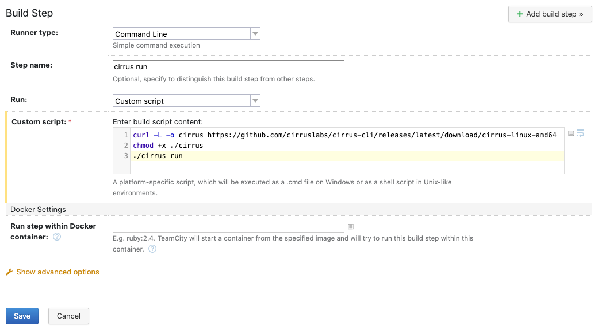

# Index

* [Homebrew](#homebrew)
* [Prebuilt Binary](#prebuilt-binary)
* [Golang](#golang)
* CI integrations
  * [Github Actions](#github-actions)
  * [Travis CI](#travis-ci)
  * [Circle CI](#circle-ci)
  * [Cirrus CI](#cirrus-ci)

# Prequisites

Since currently CLI runs all of it's tasks in [Docker](https://www.docker.com/), make sure it's [installed](https://docs.docker.com/get-docker/).

# Installation

## Homebrew

```bash
brew install cirruslabs/cli/cirrus
```

## Prebuilt Binary

Check the [releases page](https://github.com/cirruslabs/cirrus-cli/releases) for a pre-built `cirrus` binary for your platform.

Here is a one liner for Linux/macOS to download the latest release and add

```bash
curl -L -o cirrus https://github.com/cirruslabs/cirrus-cli/releases/latest/download/cirrus-$(uname | tr '[:upper:]' '[:lower:]')-amd64 \
  && sudo mv cirrus /usr/local/bin/cirrus && sudo chmod +x /usr/local/bin/cirrus
```

## Golang

If you have [Go](https://golang.org/) 1.15 or newer installed, you can run:

```
(cd && GO111MODULE=on go get github.com/cirruslabs/cirrus-cli/...)
```

This will build and place the `cirrus` binary in `$GOPATH/bin`.

To be able to run `cirrus` command from anywhere, make sure the `$GOPATH/bin` directory is added to your `PATH`
environment variable (see [article in the Go wiki](https://github.com/golang/go/wiki/SettingGOPATH) for more details).

## Github Actions

Here is an example `.github/workflows/cirrus.yml` configuration file that runs Cirrus Tasks using CLI:

```yaml
name: Run Cirrus Tasks

on:
  push:
    branches: [ master ]
  pull_request:
    branches: [ master ]

jobs:
  cirrus:
    runs-on: ubuntu-latest
    steps:
    - uses: actions/checkout@v2
    - uses: cirruslabs/cirrus-action@v2
```

**Note:** Cirrus Action integrates natively with GitHub Actions caching mechanism by using [HTTP Caching Proxy Action](https://github.com/cirruslabs/http-cache-action)

## Travis CI

Here is an example of `.travis.yml` configuration file that runs Cirrus Tasks using CLI:

```yaml
services:
  - docker

cache:
  directories:
    - /home/travis/.cache/cirrus/

before_install:
  - curl -L -o cirrus https://github.com/cirruslabs/cirrus-cli/releases/latest/download/cirrus-linux-amd64
  - sudo mv cirrus /usr/local/bin/cirrus
  - sudo chmod +x /usr/local/bin/cirrus

script: cirrus run
```

## Circle CI

Here is an example of `.circleci/config.yml` configuration file that runs Cirrus Tasks using CLI:

```yaml
version: 2.1
jobs:
 build:
   machine: true
   steps:
     - checkout
     - run: |
        curl -L -o cirrus https://github.com/cirruslabs/cirrus-cli/releases/latest/download/cirrus-linux-amd64
        sudo mv cirrus /usr/local/bin/cirrus
        sudo chmod +x /usr/local/bin/cirrus
     - run: cirrus run
```

## TeamCity

Ensure that the CLI will run on the host itself (it should use a non-Dockerized agent) and this host has [Docker installed](https://docs.docker.com/engine/install/).

Create a build step with the "Command Line" runner type and the following custom script contents:

```
curl -L -o cirrus https://github.com/cirruslabs/cirrus-cli/releases/latest/download/cirrus-linux-amd64
chmod +x ./cirrus
./cirrus run
```

The resulting configuration should look like this:



## Cirrus CI

Cirrus CLI uses the same configuration format as [Cirrus CI](https://cirrus-ci.org/) and no additional configuration is required.
