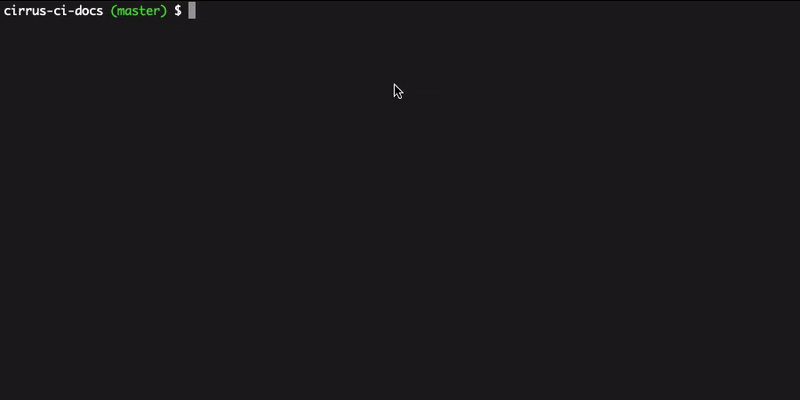

# Cirrus CLI

[](https://cirrus-ci.com/github/cirruslabs/cirrus-cli)

Cirrus CLI is a tool for running containerized tasks reproducibly in any environment. Run your tasks locally the same way
they are executed in CI or on your colleague's machine. Immutability of Docker containers ensures your project will compile
years from now regardless what versions of packages you'll have locally.



## Installation

* [Homebrew](INSTALL.md#homebrew)
* [Prebuilt Binary](INSTALL.md#prebuilt-binary)
* [Golang](INSTALL.md#golang)
* CI integrations
  * [GitHub Actions](INSTALL.md#github-actions)
  * [Travis CI](INSTALL.md#travis-ci)
  * [Circle CI](INSTALL.md#circle-ci)
  * [TeamCity](INSTALL.md#teamcity)
  * [Cloud Build](INSTALL.md#cloud-build)
  * [Cirrus CI](INSTALL.md#cirrus-ci)

## Usage

Cirrus CLI reuses the [same YAML configuration format as Cirrus CI](https://cirrus-ci.org/guide/writing-tasks/) which allows to
reuse a large [list of examples](https://cirrus-ci.org/examples/) created by Cirrus CI community.

**Note:** Cirrus CLI can be used in any environment that has Docker installed. It can be your laptop or any CI system you already have
like Jenkins, GitHub Actions, Travis CI, etc. With Cirrus CLI it's no longer a requirement to use Cirrus CI in order to benefit from Cirrus
configuration format that we (Cirrus Labs) have crafted for so long and really proud of.

Here is an example of `.cirrus.yml` configuration file for testing a Go application with several Go versions:

```yaml
task:
  env:
    matrix:
      VERSION: 1.15
      VERSION: 1.14
  name: Tests (Go $VERSION)
  container:
    image: golang:$VERSION
  modules_cache:
    fingerprint_script: cat go.sum
    folder: $GOPATH/pkg/mod
  get_script: go get ./...
  build_script: go build ./...
  test_script: go test ./...
```

### Running Cirrus Tasks

To run Cirrus tasks, simply switch to a directory where the `.cirrus.yml` is located and run:
                                
```shell script
cirrus run
```

By default, working directory will be `rsync`ed into a container while respecting `.gitignore`
configuration. This makes sure Cirrus Tasks are executed from a clean state only with source code
changes.

In case `rsync`-ing the whole working directory is too costly, you can pass a `--dirty` flag which 
will result in all operations being done against the actual working directory (and not it's `rsync`ed copy):

```shell script
cirrus run --dirty Lint
```

Since most linters and code-analysis tools are read-only by their nature there is no need in extra precautions and
the potentially costly `rsync`-ing can be safely avoided.

It is also possible to run a particular task by name:
                          
```shell script
cirrus run "Tests (Go 1.15)"
```

Or pass some extra environment variables with `-e` flag:

```shell script
cirrus run -e CIRRUS_TAG="test-release" Release
```

**Note:** Cirrus CLI only support [Linux `container`s](https://cirrus-ci.org/guide/linux/#linux-containers) instances at the moment
including [Dockerfile as a CI environment](https://cirrus-ci.org/guide/docker-builder-vm/#dockerfile-as-a-ci-environment) feature.

### Validating Cirrus Configuration

To validate a Cirrus configuration, simply switch to a directory where the `.cirrus.yml` is located and run:

```shell script
cirrus validate
```

## Caching

By default, Cirrus CLI stores blob artifacts produced by the [cache instruction](https://cirrus-ci.org/guide/writing-tasks/#cache-instruction)
in the [user-specific cached data folder](https://golang.org/pkg/os/#UserCacheDir). [Similar to Cirrus Cloud](https://cirrus-ci.org/guide/writing-tasks/#http-cache)
the CLI can use a caching HTTP server for more efficient sharing of cached artifacts between tasks executed on different physical hosts.

Caching HTTP server should support a single `/<key>` REST endpoint with `PUT`, `GET` and `HEAD` methods available for
uploading, downloading and checking availability of a cached artifact under `<key>` key respectively. There are reference
implementations of such HTTP servers for [Google Cloud Storage](https://github.com/cirruslabs/google-storage-proxy) and
[AWS S3](https://github.com/cirruslabs/aws-s3-proxy) and [Azure's Blob Storage](https://github.com/cirruslabs/azure-blob-storage-proxy).

To start using your own HTTP caching server simply pass it's hostname as `CIRRUS_HTTP_CACHE_HOST` to [`run` command](#running-cirrus-tasks):

```bash
cirrus run --environment CIRRUS_HTTP_CACHE_HOST=http-cache-host.internal:8080
```

## Security

Cirrus CLI aims to run in different environments, but in some environments we choose to provide more usability at the cost of some security trade-offs:

* SELinux
  * both the task container and the service container that copies the project directory into a per-task Docker volume using `rsync` run unconfined

Please [open an issue](https://github.com/cirruslabs/cirrus-cli/issues/new) if your use-case requires a different approach.

## FAQ

<details>
 <summary>What is the relationship between Cirrus CI and Cirrus CLI?</summary>
 
 Cirrus CI was [released in the early 2018](https://medium.com/cirruslabs/introducing-cirrus-ci-a75cd1f49af0) with an idea
 to bring some innovation to CI space. A lot of things have changed in CI-as-a-service space since then but Cirrus CI
 pioneered many ideas in CI-as-a-service space including per-second billing and support for Linux, Windows and macOS all together.
 
 Over the past two and a half years we heard only positive feedback about Cirrus CI's YAML configuration format. Users liked how
 concise their configuration looked and that it was easy to reason about.
 
 Another feedback we heard from users was that it's hard to migrate from one CI to another. There is a need to rewrite CI configurations
 from one format into another that basically still locks into another vendor.
 
 And now in 2020 with Cirrus CLI we are trying to solve the "vendor lock" problem by popularizing Cirrus configuration format
 and building community around it. Stay tuned for the upcoming option to use [Starlark templates instead of YAML](https://github.com/cirruslabs/cirrus-cli/issues/53)!
 
 Think of Cirrus CLI as an executor of Cirrus Tasks on a single machine only in Docker containers for simple CI scenarious.
 And Cirrus CI as an option for more specific cases where Cirrus Tasks can be executed in containers and VMs using 
 a [variety of supported compute services](https://cirrus-ci.org/guide/supported-computing-services/) or
 using a [managed infrastructure with per-second billing](https://cirrus-ci.org/pricing/#compute-credits).
</details>
